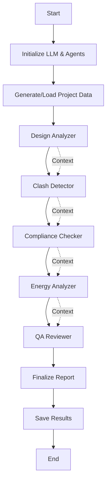

# Wah Loon Multi-Agent CAD/BIM Automation System

A sophisticated AI-powered multi-agent system for automated analysis and quality assurance of M&E (Mechanical & Electrical) CAD/BIM projects, specifically designed for Singapore's construction standards and practices.

## 🎯 Overview

This system leverages LangGraph and OpenAI's GPT models to create a collaborative multi-agent workflow that analyzes CAD/BIM projects across multiple dimensions:

- **Design Analysis** - Technical completeness and system integration
- **Clash Detection** - Spatial conflicts and coordination issues
- **Compliance Checking** - Singapore standards verification (BCA, SS530, CP5, SS564)
- **Energy Analysis** - Sustainability and efficiency optimization
- **Quality Assurance** - Comprehensive review and approval recommendations

## 🏗️ Architecture

### Multi-Agent System Design

The system employs a sequential workflow where specialized AI agents collaborate to analyze different aspects of M&E projects:

```
Project Data → Design Analyzer → Clash Detector → Compliance Checker 
             → Energy Analyzer → QA Reviewer → Final Report
```

Each agent is powered by an LLM (GPT-4) with specialized system prompts and domain expertise.

### Key Components

#### 1. **Agents** (`src/agents/`)
- `agent_base.py` - Base class providing common functionality
- `design_analyzer.py` - Senior M&E Design Engineer agent
- `clash_detector.py` - BIM Coordination Specialist agent
- `compliance_checker.py` - Singapore M&E Compliance Expert agent
- `energy_analyzer.py` - Energy Efficiency Specialist agent
- `qa_reviewer.py` - Quality Assurance Lead agent

#### 2. **Workflows** (`src/workflows/`)
- `multi_agent_workflow.py` - LangGraph orchestration engine
- `state_schema.py` - State management and TypedDict schemas

#### 3. **Data Generation** (`src/data/`)
- `generators.py` - Realistic CAD/BIM project data generator

#### 4. **Utilities** (`src/utils/`)
- `config.py` - Configuration management
- `logger.py` - Logging utilities

## 🚀 Getting Started

### Prerequisites

- Python 3.8 or higher
- OpenAI API key
- Virtual environment (recommended)

### Installation

1. **Clone or navigate to the project directory:**
```bash
cd F:\AI_Coding\wahloon-multi-agent-cad
```

2. **Create and activate virtual environment:**
```bash
python -m venv .myenv
.myenv\Scripts\activate  # Windows
# source .myenv/bin/activate  # Linux/Mac
```

3. **Install dependencies:**
```bash
pip install -r requirements.txt
```

4. **Configure environment variables:**

Create a `.env` file in the project root:
```env
OPENAI_API_KEY=your_openai_api_key_here
OPENAI_MODEL=gpt-4
OPENAI_TEMPERATURE=0.1
LOG_LEVEL=INFO
```

### Quick Start

#### Single Project Analysis

```bash
python main.py --mode single --project-id WL-2024-001 --design-intent "Sustainable M&E design for commercial tower"
```

#### Batch Analysis

```bash
python main.py --mode batch --project-count 5
```

#### Using the Python API

```python
import asyncio
from src.workflows.multi_agent_workflow import EnhancedMEAgentWorkflow
from src.data.generators import WahLoonDataGenerator
from langchain_openai import ChatOpenAI

async def analyze_project():
    # Initialize LLM
    llm = ChatOpenAI(model="gpt-4", temperature=0.1)
    
    # Generate project data
    generator = WahLoonDataGenerator()
    project_data = generator.generate_cad_project("WL-2024-TEST-001")
    
    # Run workflow
    workflow = EnhancedMEAgentWorkflow(llm)
    results = await workflow.run_workflow(project_data)
    
    return results

# Execute
results = asyncio.run(analyze_project())
```

## 📊 Project Structure

```
wahloon-multi-agent-cad/
├── src/
│   ├── agents/                 # Specialized AI agents
│   │   ├── agent_base.py      # Base agent class
│   │   ├── design_analyzer.py
│   │   ├── clash_detector.py
│   │   ├── compliance_checker.py
│   │   ├── energy_analyzer.py
│   │   └── qa_reviewer.py
│   ├── workflows/              # LangGraph workflows
│   │   ├── multi_agent_workflow.py
│   │   └── state_schema.py
│   ├── data/                   # Data generation
│   │   └── generators.py
│   └── utils/                  # Utilities
│       ├── config.py
│       └── logger.py
├── examples/
│   └── basic_usage.py         # Usage examples
├── tests/                      # Unit tests
│   ├── test_agents.py
│   └── test_workflows.py
├── output/                     # Analysis results
├── main.py                     # CLI entry point
├── requirements.txt            # Dependencies
├── .env                        # Environment variables (create this)
└── README.md                   # This file
```

## 🔧 Agent Descriptions

### Design Analyzer Agent
**Role:** Senior M&E Design Engineer  
**Responsibilities:**
- Assess design completeness (scoring 0-100)
- Identify missing systems and documentation gaps
- Evaluate technical risks with severity levels
- Analyze system integration (electrical-mechanical, mechanical-plumbing)
- Review constructability and installation sequences
- Provide prioritized recommendations

**Key Outputs:**
```json
{
  "completeness_assessment": {
    "score": 85,
    "missing_systems": ["Fire alarm integration"],
    "documentation_gaps": ["Cable schedules incomplete"]
  },
  "technical_risks": [
    {
      "risk": "Inadequate cooling capacity",
      "severity": "HIGH",
      "impact": "schedule",
      "recommendation": "Increase chiller capacity by 15%"
    }
  ]
}
```

### Clash Detection Agent
**Role:** BIM Coordination Specialist  
**Responsibilities:**
- Detect spatial conflicts between M&E systems
- Identify coordination issues
- Analyze construction sequence problems
- Estimate cost and schedule impacts
- Propose resolution strategies

**Key Outputs:**
```json
{
  "spatial_clashes": [
    {
      "clash_id": "C001",
      "elements": ["Electrical Conduit", "HVAC Duct"],
      "location": "Level 5 Ceiling Void",
      "severity": "HIGH",
      "clearance_violation_mm": 150,
      "estimated_cost_impact_sgd": 5000
    }
  ],
  "summary_metrics": {
    "total_clashes": 8,
    "critical_clashes": 2
  }
}
```

### Compliance Checker Agent
**Role:** Singapore M&E Compliance Expert  
**Responsibilities:**
- Verify compliance with Singapore standards:
  - BCA Green Mark 2021
  - SS530 (Energy Efficiency)
  - CP5 (Electrical Installations)
  - SS564 (Plumbing Standards)
- Assess certification feasibility
- Identify regulatory risks
- Provide rectification requirements

**Key Outputs:**
```json
{
  "standards_compliance": [
    {
      "standard": "SS530",
      "requirement": "Motor efficiency IE3+",
      "status": "NON_COMPLIANT",
      "severity": "HIGH",
      "rectification_required": "Replace motors with IE3 rated units"
    }
  ],
  "certification_impact": {
    "green_mark_achievable": "Gold",
    "missing_requirements": ["Energy monitoring points"]
  }
}
```

### Energy Analyzer Agent
**Role:** Energy Efficiency Specialist  
**Responsibilities:**
- Calculate energy performance metrics
- Identify efficiency opportunities
- Assess sustainability potential
- Perform cost-benefit analysis
- Recommend equipment upgrades

**Key Outputs:**
```json
{
  "efficiency_opportunities": [
    {
      "measure": "VSD installation for AHUs",
      "savings_percent": 25,
      "cost_savings_sgd_year": 45000,
      "payback_period_years": 2.5,
      "green_mark_points": 3
    }
  ],
  "cost_benefit_analysis": {
    "total_annual_savings_sgd": 120000,
    "simple_payback_years": 3.2
  }
}
```

### QA Reviewer Agent
**Role:** Quality Assurance Lead  
**Responsibilities:**
- Synthesize all agent findings
- Provide comprehensive quality scoring
- Assess overall project risks
- Generate executive summary
- Make GO/NO-GO recommendation

**Key Outputs:**
```json
{
  "quality_assessment": {
    "overall_score": 78,
    "design_quality_score": 82,
    "compliance_quality_score": 75
  },
  "recommendations": {
    "project_status": "GO_WITH_ISSUES",
    "key_decisions": ["Resolve critical clashes before construction"],
    "priority_actions": [...]
  }
}
```

## 🎨 Key Features

### 1. **Automated Multi-Dimensional Analysis**
- Parallel processing of multiple analysis dimensions
- Context-aware agent collaboration
- Comprehensive quality assessment

### 2. **Singapore Standards Integration**
- Built-in knowledge of local regulations
- BCA Green Mark compliance checking
- SS530, CP5, SS564 verification

### 3. **Practical Engineering Focus**
- Constructability analysis
- Cost and schedule impact estimation
- Actionable recommendations

### 4. **State Management with LangGraph**
- Type-safe state transitions
- Error handling and recovery
- Progress tracking and metrics

### 5. **Flexible Data Generation**
- Realistic test data generation
- Customizable project parameters
- Support for various building types

## 📈 Output Analysis

The system generates comprehensive JSON reports containing:

1. **Project Information**
   - ID, name, client, location
   - Technical specifications
   - Timeline and budget

2. **Agent-Specific Analyses**
   - Detailed findings from each specialized agent
   - Quantified metrics and scores
   - Prioritized recommendations

3. **Final Report**
   - Executive summary
   - Quality scores across all dimensions
   - Critical issues and risks
   - GO/NO-GO recommendation

4. **Performance Metrics**
   - Processing time per agent
   - Total workflow duration
   - Error and warning counts

### Sample Output Structure

```json
{
  "project_id": "WL-2024-001",
  "project_name": "Commercial Tower Project",
  "design_analysis": { ... },
  "clash_analysis": { ... },
  "compliance_check": { ... },
  "energy_analysis": { ... },
  "qa_report": { ... },
  "final_report": {
    "executive_summary": "...",
    "quality_scores": { ... },
    "final_recommendation": "GO_WITH_ISSUES"
  },
  "processing_times": {
    "total": 45.2
  }
}
```

## 🧪 Testing

Run the test suite:

```bash
# All tests
pytest tests/

# Specific test file
pytest tests/test_agents.py

# With coverage
pytest tests/ --cov=src --cov-report=html
```

## 🔐 Security & Best Practices

1. **API Key Management**
   - Store API keys in `.env` file
   - Never commit `.env` to version control
   - Use environment variables in production

2. **Error Handling**
   - Comprehensive try-catch blocks
   - Graceful degradation on agent failures
   - Detailed error logging

3. **Data Privacy**
   - No persistent storage of project data
   - In-memory processing only
   - Configurable data retention

## 📝 Configuration Options

### Environment Variables

| Variable | Description | Default |
|----------|-------------|---------|
| `OPENAI_API_KEY` | OpenAI API key | Required |
| `OPENAI_MODEL` | Model to use | `gpt-4` |
| `OPENAI_TEMPERATURE` | Model temperature | `0.1` |
| `LOG_LEVEL` | Logging level | `INFO` |
| `MAX_CONCURRENT_AGENTS` | Max parallel agents | `5` |
| `TIMEOUT_SECONDS` | Agent timeout | `300` |

### Command Line Options

```bash
python main.py --help

Options:
  --mode {single,batch}       Run mode
  --project-id ID            Project identifier
  --project-count N          Number of projects (batch mode)
  --design-intent TEXT       Design intent description
  --output-dir PATH          Output directory
```

## 🤝 Contributing

This is a specialized internal tool for Wah Loon Engineering. For enhancements or bug reports, please contact the development team.

## 📚 Dependencies

Core frameworks and libraries:

- **LangChain** 0.0.354 - LLM application framework
- **LangGraph** - Multi-agent workflow orchestration
- **OpenAI** 1.12.0 - LLM API integration
- **Pandas/NumPy** - Data processing
- **Faker** - Test data generation
- **Pydantic** - Data validation
- **python-dotenv** - Environment management

See `requirements.txt` for complete dependency list.

## 🔄 Workflow Execution Flow



## 🎓 Usage Examples

### Example 1: Hospital Project Analysis

```python
import asyncio
from src.workflows.multi_agent_workflow import EnhancedMEAgentWorkflow
from langchain_openai import ChatOpenAI

async def analyze_hospital():
    llm = ChatOpenAI(model="gpt-4", temperature=0.1)
    workflow = EnhancedMEAgentWorkflow(llm)
    
    hospital_data = {
        "project_id": "WL-2024-HOSPITAL-001",
        "project_name": "New Hospital Wing",
        "total_area_sqm": 35000,
        "green_mark_target": "Platinum",
        # ... additional specs
    }
    
    design_intent = """
    Critical healthcare facility requiring:
    - 100% backup power for critical loads
    - Medical gas systems integration
    - Infection control HVAC design
    - BCA Green Mark Platinum certification
    """
    
    results = await workflow.run_workflow(hospital_data, design_intent)
    return results

asyncio.run(analyze_hospital())
```

### Example 2: Batch Processing

```python
# Process multiple projects in sequence
python main.py --mode batch --project-count 10 --output-dir batch_results
```

## 🏆 Performance Metrics

Typical performance for a standard commercial project:

- **Design Analysis:** 8-12 seconds
- **Clash Detection:** 10-15 seconds
- **Compliance Check:** 8-10 seconds
- **Energy Analysis:** 10-12 seconds
- **QA Review:** 12-15 seconds
- **Total Workflow:** 45-65 seconds

## 📞 Support

For technical support or questions:
- Review the documentation in `Wah Loon Multi-Agent CADBIM Automation System.pdf`
- Check the `examples/` directory for usage patterns
- Consult the development team

## 📄 License

Proprietary software for Wah Loon Engineering Pte Ltd.

## 🔖 Version History

- **v1.0** - Initial release with core multi-agent functionality
  - 5 specialized agents
  - LangGraph integration
  - Singapore standards compliance
  - Comprehensive reporting

---

**Built for Wah Loon Engineering Pte Ltd**  
*Advancing M&E Excellence through AI Innovation*
